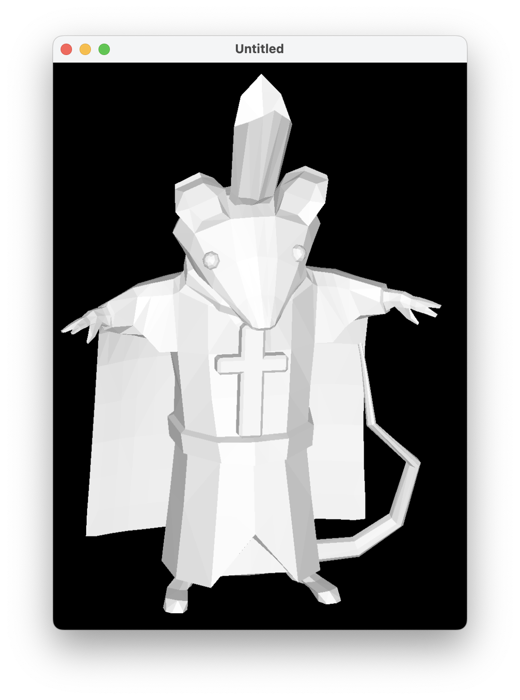

# GraphicsLab

## Main

This program provides tools for work with points and their connections in 3d space.

## Preview

Render of model from [here](https://sketchfab.com/3d-models/dorime-rat-65df530434624400b030da4579baa4b6):

## Input

Actions of work with points and their connections are placed in context menu which can be opened by right mouse button click.
Using left mouse button you can select points using drag, if you have any selected points, you can in context menu switch mod to dragging, and thus you can move your points.

Toolbar contains:
* Actions for import, export and clean in Actions section;
* Dialogs for input of world offset, scale and rotations in Assign section;
* Changing of mode between wireframe and ray tracing in Render section;
* Info about keyboard buttons in Help section.

## Render

There are implemented simple ray tracing algorithm working on triangles.

## Performance

Picture from above containing ~8000 points, ~2600 triangles in resolution of 900x1200 is renders in ~10 seconds on my 3.6GHz dual-core Intel Core i5.

## Import/Export

Import and export is implemented using json format and data is copies and pastes via clipboard.
Converter from STL to this program format is [here](https://gist.github.com/yoloroy/d518d6ca6fe2ccdd797b978aa9daefdc).

## TODO

1. Textures
2. Lights and shadows
3. Materials and reflections
4. Anti-aliasing
